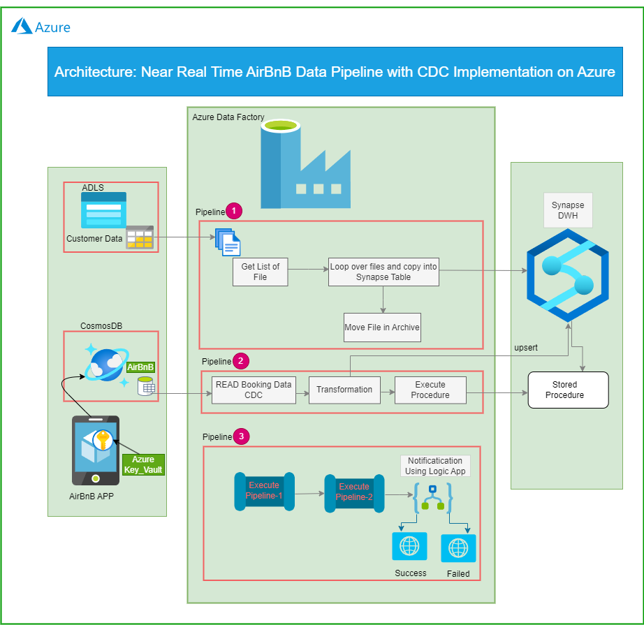

# **End-to-End Data Engineering: Near Real-Time CDC Pipeline for AirBnB Data on Azure**
### **Introduction**
This project implements a **near real-time Change Data Capture (CDC) pipeline** for processing AirBnB data using Azure services, ensuring seamless integration and continuous data flow.

---
### **Architecture**

### **Technology Used**
1. **Programming Language**: Python  
2. **Scripting Language**: SQL  
3. **NoSQL**: CosmosDB  
4. **Azure Cloud Platform**:
   - Azure Data Lake Storage (ADLS)
   - Azure Data Factory
   - Azure Synapse Analytics
### **Steps Involved in the Project**
## **Table of Contents**
| Section | Description |
|---------|-------------|
| [1. Change Data Capture (CDC)](#1-change-data-capture-cdc) | Overview of CDC and its importance in transactional and NoSQL databases |
| [2. ADLS (Azure Data Lake Storage)](#2-adls-azure-data-lake-storage) | Managing incoming customer delta data in ADLS |
| [3. AirBnB Backend](#3-airbnb-backend) | Using Cosmos DB to manage AirBnB's backend booking data |
| [4. Pipeline 1: Customer Data Processing](#4-pipeline-1-customer-data-processing) | Description of the ADF pipeline for processing customer data |
| [5. Pipeline 2: Booking Data Processing](#5-pipeline-2-booking-data-processing) | Processing AirBnB booking data from Cosmos DB |
| [6. Pipeline 3: Execute Pipelines](#6-pipeline-3-execute-pipeline-1-and-pipeline-2) | Coordinating the execution of both pipelines |

---

### 1. **Change Data Capture (CDC)**

When working with transactional or NoSQL databases, operations like inserting, deleting, or updating data are common. This process is known as **Change Data Capture (CDC)**, which captures changes from the source, such as reading, inserting, updating, or deleting data. 

This project implements a **CDC pipeline** on Azure to ensure near real-time integration of AirBnB data.

---

### 2. **ADLS (Azure Data Lake Storage)**

Inside **Azure Data Lake Storage (ADLS)**, there is a container (e.g., "customer data"). Every 30 minutes, delta data is received in the form of **CSV files**, containing new customers onboarded or updates to existing customers. Within two hours, up to four files are expected to be available in the system.

The files are processed and archived in ADLS to ensure continuous and efficient data flow.

---

### 3. **AirBnB Backend**

The AirBnB application interacts with **Cosmos DB**, a scalable NoSQL database. Cosmos DB contains a database named **AirBnB**, with a container named **Bookings**. 

Data is continuously generated through Python scripts and written into Cosmos DB. Updates made through the AirBnB UI trigger the CDC pipeline, ensuring real-time data processing.

---

### 4. **Pipeline 1: Customer Data Processing**

This pipeline runs every two hours in **Azure Data Factory (ADF)** and performs the following steps:
- Retrieve the list of available customer files in ADLS.
- Copy the files to a **Synapse table** for processing.
- Archive the processed files.
- Perform **upsert** operations and transformation of booking data, creating a **booking fact table**.
- Generate a **materialized view** using a **Stored Procedure** in Synapse.

---

### 5. **Pipeline 2: Booking Data Processing**

This pipeline reads booking data directly from **Cosmos DB** and processes it for further analysis. It captures any CDC updates and ensures data is consistently up to date.

---

### 6. **Pipeline 3: Execute Pipeline 1 and Pipeline 2**

This pipeline coordinates the execution of both **Pipeline 1** and **Pipeline 2**, ensuring customer and booking data are processed in a synchronized manner.

---

### Summary

This project demonstrates a complete **end-to-end data engineering pipeline** for near real-time processing of AirBnB data using Azure. The architecture captures, processes, and transforms both customer and booking data in real-time, leveraging services like ADLS, ADF, Synapse, and Cosmos DB.

---
